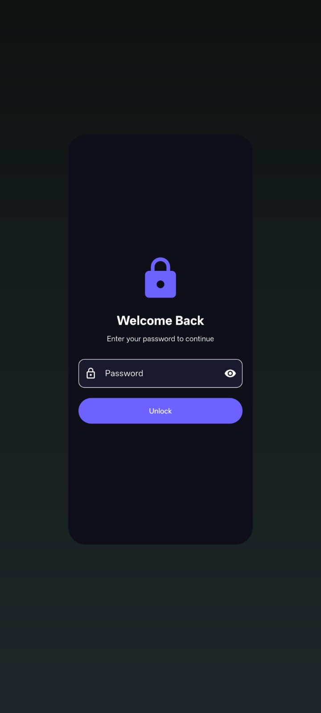
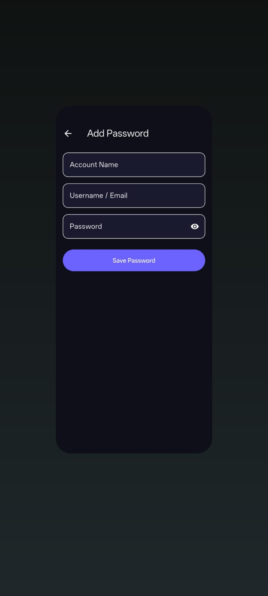
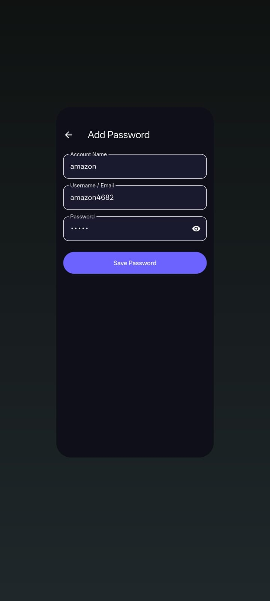
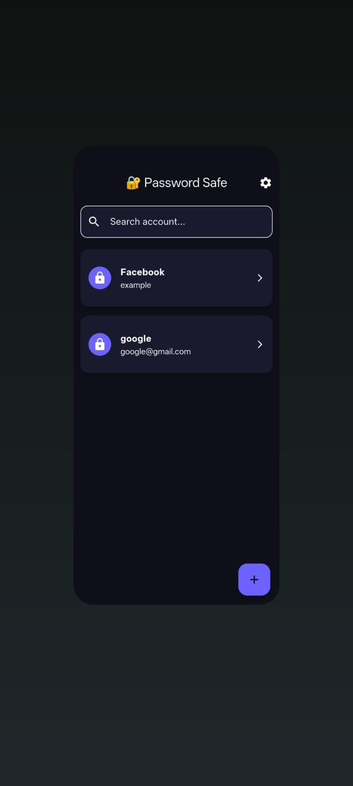

# 🔐 Password Safe

  
  
  

**Password Safe** is a high-performance, secure, and intuitive credential management application built for Android. Designed with a privacy-first approach, it ensures that your sensitive information remains encrypted and stored strictly on your local device.

---

## 📱 App Preview
*(Upload your screenshots to your repo's 'assets' folder and update the paths below)*

## Login Screen  | 

 

## Home 
  

## Add Password 
   

## Search Password
   
  

---

## 🌟 Key Features

### 🛡️ Local-Only Encryption
We prioritize your privacy. No cloud syncing, no third-party APIs. All your data is encrypted using advanced algorithms and stored in an internal database on your device.

### 🔑 Secure Vault
Store passwords, pin codes, and private notes in a single, organized, and secure location. Access all your credentials with a single Master Password.

### ⚡ Lightning Fast Search
Quickly find your credentials using our optimized search filter. No more scrolling through long lists; get what you need in milliseconds.

### 🎨 Clean & Modern UI
Built with Flutter, the app offers a fluid and responsive user experience. The Material Design aesthetic ensures it feels native and professional on all Android devices.

---

## 🛠 Tech Stack
- **Framework:** [Flutter](https://flutter.dev/)
- **Language:** [Dart](https://dart.dev/)
- **Database:** [SQLite / Hive / Cloud Firestore](Mention your local DB)
- **Architecture:** MVVM (Model-View-ViewModel)

---

## 📥 Download Latest Version
Download the latest signed APK from the link below:

👉 **[Download Password Safe v1.0.0 APK](https://github.com/YOUR_USERNAME/YOUR_REPO_NAME/releases/latest)**

---

## 👨‍💻 Developed By
**Shayan Azhar**  
*Mobile & Web App Developer*

[GitHub](https://github.com/YOUR_USERNAME) | [LinkedIn](YOUR_LINKEDIN_URL) | [Portfolio](YOUR_PORTFOLIO_URL)

---

## 🛡 Security Assurance
Your security is our top priority. Password Safe does not require internet permissions to function, ensuring that your data is never exposed to external threats or servers.

*© 2026 Shayan Azhar. All rights reserved.*
